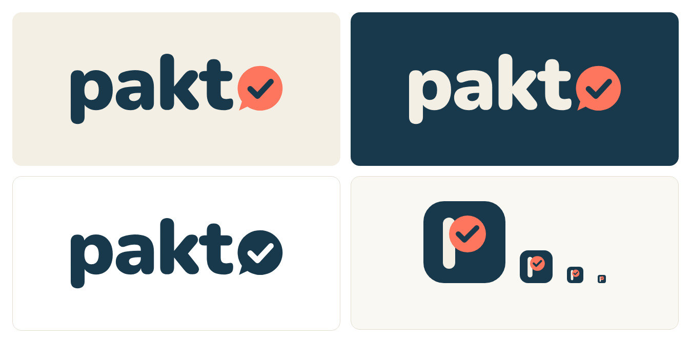

# Pakto brand: logo

Decided on 06.10.2026 (project thread "logo suggestions" in the Pakto Claude project). The files here are the final versions. In the app: `public/pakto-logo.svg` / `pakto-logo-dark.svg` (wordmark, used by `Wordmark` and the marketing nav/footer), `public/pakto-mark.svg` and `public/icon.svg` (icon, favicon, PWA), `public/apple-touch-icon.png`, `public/icon-192.png`, `public/icon-512.png`, and the email logo PNG in `src/lib/email/logo.ts`.

## Wordmark

- "pakt" in **Nunito Black (900)**, slight negative tracking (-0.02em).
- The **"o" is a chat bubble with a tick**: coral `#FF765F` bubble, tail bottom-left, navy `#18394C` tick. It stands for the client answering in the portal and approving the offer.
- Text is outlined to paths, so the SVGs do not need the font.
- `pakto-logo.svg`: navy text, for light backgrounds (cream `#f4efe4` or white).
- `pakto-logo-dark.svg`: cream text, for navy backgrounds.
- `pakto-logo-mono.svg`: one colour (navy), for PDFs and print.

## App icon

- `pakto-icon.svg`: navy rounded square, cream "p" stem, the bowl of the "p" is a coral circle with a navy tick.
- Rendered: `pakto-icon-512.png`, `pakto-icon-192.png` (PWA manifest), `apple-touch-icon.png` (180 px), `favicon-32.png`.
- Checked down to 16 px.

## Palette

Unchanged from `src/app/globals.css`: navy `#18394C` / `#102b38`, coral `#FF765F`, cream `#f4efe4`, green `#BCEBA8`, blue `#A6D8DF`.

